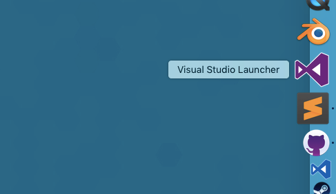

# Visual Studio Launcher OSX
This Apple Script allows your to run multiple instances of Visual Studio in OSX at once. 

Essentially all the script does is call the following:

`do shell script "open -n /Applications/Visual\\ Studio.app/"`

You can rework this for different applications if you want to (like Xamarin Studio!)

# To Install
Download the [release](https://github.com/rtroe/VisualStudioLauncherOSX/releases) (or clone the latest repo). 

You'll need to extract the download, then the Visual Studio Launcher.zip file inside of there to get the .app file. 

Then simply pop the 'Visual Studio Launcher.app' file from there into your Applications folder. You can then drag it into the dock bar after that.
